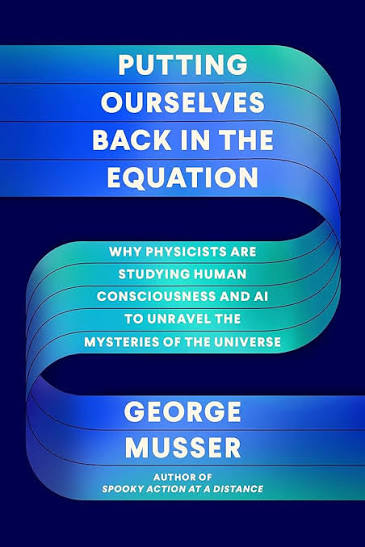
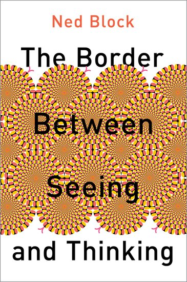
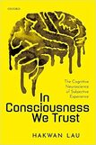
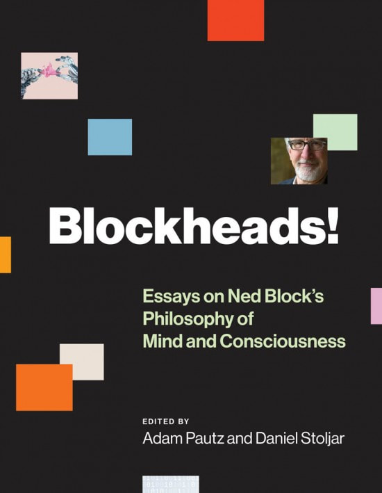
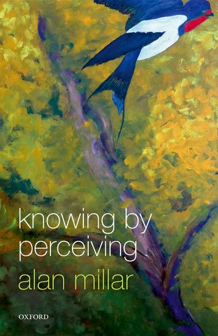
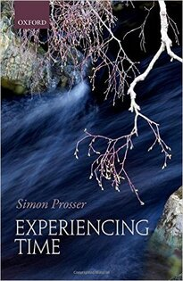
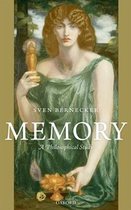
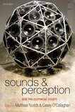
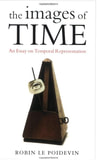
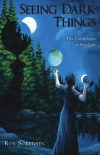

## 2023

::: {.pub-list}

::: {.review}

{.cover-thumb fig-alt="Cover of Putting Ourselves Back in the Equation"}

::: {.review-text}
**[Chasing an equation for awareness](files/reviews/chasing-an-equation-for-awareness.pdf)**. Review of G. Musser, *Putting Ourselves Back in the Equation*. *Science*, 382(6676), 2023. With Chaz Firestone.
:::

:::

::: {.review}

{.cover-thumb fig-alt="Cover of The Border Between Seeing and Thinking"}

::: {.review-text}
**[Seeing fast and thinking slow](files/reviews/seeing-fast-and-thinking-slow.pdf)**. Review of Ned Block, *The Border Between Seeing and Thinking*. *Science*, 379(6638), 2023. With Chaz Firestone.
:::

:::

:::

## 2022

::: {.pub-list}

::: {.review}

{.cover-thumb fig-alt="Cover of In Consciousness We Trust"}

::: {.review-text}
**[Review of In Consciousness We Trust](https://www.thebsps.org/reviewofbooks/phillips-and-brown-on-lau/)**. Review of Hakwan Lau, *In Consciousness We Trust*. *BJPS Review of Books*, 2022. With Simon Brown.
:::

:::

::: {.review}

{.cover-thumb fig-alt="Cover of Blockheads! Essays on Ned Block’s Philosophy of Mind and Consciousness"}

::: {.review-text}
**[Review of Blockheads! Essays on Ned Block’s Philosophy of Mind and Consciousness](files/reviews/blockheads.pdf)**. Review of A. Pautz and D. Stoljar, eds., *Blockheads! Essays on Ned Block’s Philosophy of Mind and Consciousness*. *Mind*, 131, 2022.
:::

:::

:::

## 2019

::: {.pub-list}

::: {.review}

{.cover-thumb fig-alt="Cover of Knowing by Perceiving"}

::: {.review-text}
**[Review of Knowing by Perceiving](https://ndpr.nd.edu/reviews/knowing-by-perceiving/)**. Review of Alan Millar, *Knowing by Perceiving*. *Notre Dame Philosophical Reviews*, 11 June 2019.
:::

:::

:::

## 2016

::: {.pub-list}

::: {.review}

{.cover-thumb fig-alt="Cover of Experiencing Time"}

::: {.review-text}
**[Review of Experiencing Time](https://ndpr.nd.edu/reviews/experiencing-time/)**. Review of Simon Prosser, *Experiencing Time*. *Notre Dame Philosophical Reviews*, 1 December 2016.
:::

:::

:::

## 2012

::: {.pub-list}

::: {.review}

{.cover-thumb fig-alt="Cover of Memory: A Philosophical Study"}

::: {.review-text}
**[Review of Memory: A Philosophical Study](files/reviews/memory-a-philosophical-study.pdf)**. Review of Sven Bernecker, *Memory: A Philosophical Study*. *Mind*, 121(428), 2012.
:::

:::

:::

## 2010

::: {.pub-list}

::: {.review}

{.cover-thumb fig-alt="Cover of Sounds and Perception"}

::: {.review-text}
**[Review of Sounds and Perception](files/reviews/sounds-and-perception-jcs.pdf)**. Review of Matthew Nudds and Casey O’Callaghan, eds., *Sounds and Perception*. *Journal of Consciousness Studies*, 17, 2010.
:::

:::

::: {.review}

{.cover-thumb fig-alt="Cover of Sounds and Perception"}

::: {.review-text}
**[Where the dog barks](files/reviews/where-the-dog-barks.pdf)**. Review of Matthew Nudds and Casey O’Callaghan, eds., *Sounds and Perception*. *Times Literary Supplement*, 5597, 9 July 2010.
:::

:::

:::

## 2009

::: {.pub-list}

::: {.review}

{.cover-thumb fig-alt="Cover of The Images of Time"}

::: {.review-text}
**[Review of The Images of Time](files/reviews/the-images-of-time.pdf)**. Review of Robin Le Poidevin, *The Images of Time*. *British Journal for the Philosophy of Science*, 60(2), 2009.
:::

:::

::: {.review}

{.cover-thumb fig-alt="Cover of Seeing Dark Things"}

::: {.review-text}
**[What is a shadow?](files/reviews/what-is-a-shadow.pdf)**. Review of Roy Sorensen, *Seeing Dark Things: The Philosophy of Shadows*. *Times Literary Supplement*, 5532, 10 April 2009.
:::

:::

:::