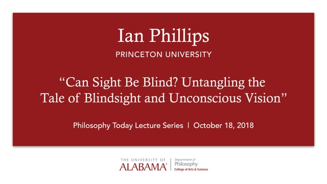

## 2022

::: {.talk-list}

::: {.talk}
[{.talk-thumb}](https://www.youtube.com/watch?t=1s&v=rAOU0iNZu9c)

::: {.talk-text}
**[Perception, Action and Experience](https://www.youtube.com/watch?t=1s&v=rAOU0iNZu9c)**. Shulman Lecture, Yale, 2022.
:::
:::

::: {.talk}
[{.talk-thumb}](https://www.youtube.com/watch?v=SfoJHXIzRzE)

::: {.talk-text}
**[Perception, Action & Experience](https://www.youtube.com/watch?v=SfoJHXIzRzE)**. Consciousness Club, 2022.
:::
:::

:::

## 2021

::: {.talk-list}

::: {.talk}
[{.talk-thumb}](https://www.youtube.com/watch?t=14s&v=JIZft98WI98)

::: {.talk-text}
**[Bewitched by Blindsight](https://www.youtube.com/watch?t=14s&v=JIZft98WI98)**. Centre for Vision Research, York, 2021.
:::
:::

:::

## 2018

::: {.talk-list}

::: {.talk}
[{.talk-thumb}](https://vimeo.com/296648725)

::: {.talk-text}
**[Can Sight Be Blind? Untangling the Tale of Blindsight and Unconscious Vision](https://vimeo.com/296648725)**. Philosophy Today Lecture, University of Alabama, 2018.
:::
:::

:::

## 2017

::: {.talk-list}

::: {.talk}
[{.talk-thumb}](https://www.youtube.com/watch?feature=youtu.be&v=Cct1Cif4OxU)

::: {.talk-text}
**[Debate on Unconscious Perception](https://www.youtube.com/watch?feature=youtu.be&v=Cct1Cif4OxU)**. NYU, 2017. With Marisa Carrasco, Hakwan Lau, Megan Peters, and Ned Block.
:::
:::

:::

## 2015

::: {.talk-list}

::: {.talk}
[{.talk-thumb}](https://www.youtube.com/watch?v=wLNmlRV84ZY)

::: {.talk-text}
**[Unconscious Perception Reconsidered](https://www.youtube.com/watch?v=wLNmlRV84ZY)**. Philosophy, Psychology and Informatics Reading Group, Edinburgh, 2015.
:::
:::

:::

## 2012

::: {.talk-list}

::: {.talk}
[{.talk-thumb}](https://www.youtube.com/watch?v=4UYXokI4eLk)

::: {.talk-text}
**[Swimming Against the Stream of Consciousness](https://www.youtube.com/watch?v=4UYXokI4eLk)**. TEDxUCL, 2012.
:::
:::

:::